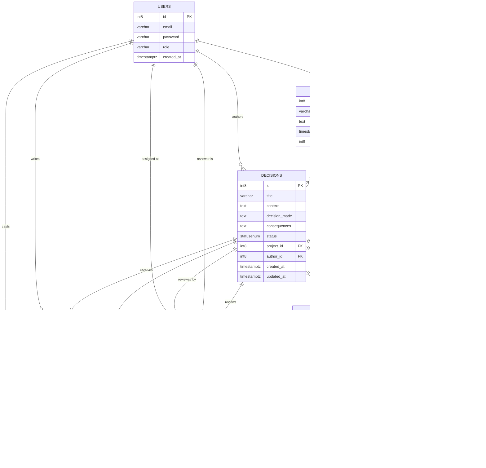

# ArchTrack - Architecture Decision Records Management System

```mermaid
erDiagram
    %% ========== ENTITIES ==========
    USERS {
        int8 id PK
        varchar email
        varchar password
        varchar role
        timestamptz created_at
    }

    PROJECTS {
        int8 id PK
        varchar name
        text description
        timestamptz created_at
        int8 owner_id FK
    }

    DECISIONS {
        int8 id PK
        varchar title
        text context
        text decision_made
        text consequences
        statusenum status
        int8 project_id FK
        int8 author_id FK
        timestamptz created_at
        timestamptz updated_at
    }

    OPTIONS {
        int8 id PK
        varchar title
        text description
        text pros
        text cons
        int8 decision_id FK
        timestamptz created_at
    }

    VOTES {
        int8 id PK
        int8 user_id FK
        int8 decision_id FK
        int8 option_id FK
    }

    COMMENTS {
        int8 id PK
        text body
        int8 decision_id FK
        int8 author_id FK
        timestamptz created_at
    }

    TAGS {
        int8 id PK
        varchar name
    }

    %% ========== JUNCTION TABLES (Relationship Nodes) ==========
    DECISION_TAGS {
        int8 decision_id PK,FK
        int8 tag_id PK,FK
        timestamptz assigned_at "audit field"
    }

    DECISION_REVIEWERS {
        int8 decision_id PK,FK
        int8 reviewer_id PK,FK
        varchar review_status "pending|approved|rejected"
        timestamptz assigned_at
    }

    %% ========== RELATIONSHIPS ==========
    USERS ||--o{ PROJECTS : "owns"
    USERS ||--o{ DECISIONS : "authors"
    USERS ||--o{ COMMENTS : "writes"
    USERS ||--o{ VOTES : "casts"
    USERS ||--o{ DECISION_REVIEWERS : "assigned as"

    PROJECTS ||--o{ DECISIONS : "contains"

    DECISIONS ||--o{ OPTIONS : "has"
    DECISIONS ||--o{ COMMENTS : "receives"
    DECISIONS ||--o{ VOTES : "receives"
    DECISIONS ||--o{ DECISION_TAGS : "tagged with"
    DECISIONS ||--o{ DECISION_REVIEWERS : "reviewed by"

    OPTIONS ||--o{ VOTES : "receives"

    TAGS ||--o{ DECISION_TAGS : "labels"

    %% ========== RELATIONSHIP NODE CONNECTIONS ==========
    DECISION_TAGS }o--|| TAGS : "belongs to"
    DECISION_TAGS }o--|| DECISIONS : "applies to"
    DECISION_REVIEWERS }o--|| USERS : "reviewer is"
    DECISION_REVIEWERS }o--|| DECISIONS : "reviews"
```